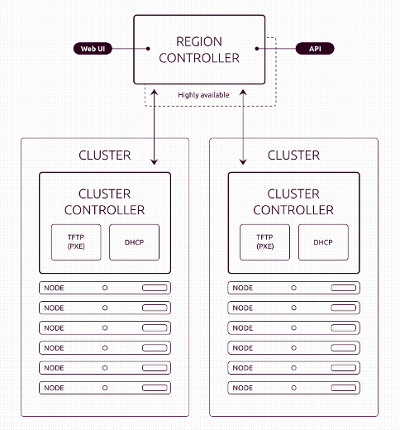

Title: MAAS Orientation

# Orientation

## MAAS in Brief

Canonical’s MAAS brings the dynamism of cloud computing to the world of
physical provisioning and Ubuntu. Connect, commission and deploy physical
servers in record time, re-allocate nodes between services dynamically, and
keep them up to date and in due course, retire them from use.

MAAS is a new way of thinking about physical infrastructure. Compute, storage
and network are commodities in the virtual world, and for large-scale
deployments the same is true of the metal. “Metal as a service” lets you treat
farms of servers as a malleable resource for allocation to specific problems,
and re-allocation on a dynamic basis.

In conjunction with the Juju service orchestration software (see
[https://juju.ubuntu.com/docs/](https://juju.ubuntu.com/docs/)), MAAS will
enable you to get the most out of your physical hardware and dynamically
deploy complex services with ease and confidence.

## A Typical MAAS setup

MAAS is designed to work with your physical hardware, whether your setup
includes thousands of server boxes or only a few. The key components of the
MAAS software are:

* Region controller
* Cluster controller(s)
* Nodes

For small (in terms of number of nodes) setups, you will probably just install
the Region controller and a cluster controller on the same server - it is only
worth having multiple region controllers if you need to organise your nodes
into different subnets (e.g. if you have a lot of nodes).

